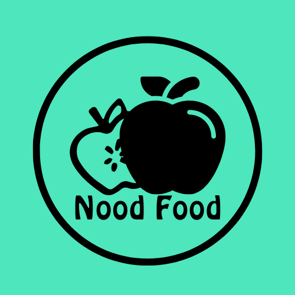
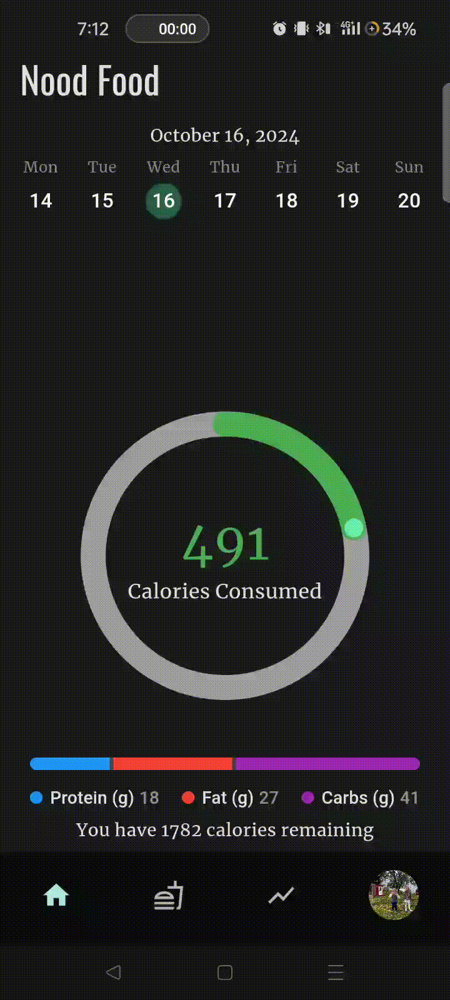

<a id="readme-top"></a>

<!-- PROJECT LOGO -->
<br />
<div align="center">
  <a href="https://github.com/Barking-Grizzly/Nood-Food">
    
  </a>

  <h3 align="center">Nood Food</h3>  

  <p align="center">
    An Android/IOS application that helps you track your consumed calories with ease!
    <br />
    <a href="https://github.com/Barking-Grizzly/Nood-Food"><strong>Explore the docs »</strong></a>
    <br />
    <br />
    <a href="https://github.com/Barking-Grizzly/Nood-Food">View Demo</a>
    ·
    <a href="https://github.com/Barking-Grizzly/Nood-Food/issues/new?labels=bug&template=bug-report---.md">Report Bug</a>
    ·
    <a href="https://github.com/Barking-Grizzly/Nood-Food/issues/new?labels=enhancement&template=feature-request---.md">Request Feature</a>
  </p>
</div>

<!-- TABLE OF CONTENTS -->
<details>
  <summary>Table of Contents</summary>
  <ol>
    <li>
      <a href="#about-the-project">About The Project</a>
      <ul>
        <li><a href="#built-with">Built With</a></li>
      </ul>
    </li>
    <li>
      <a href="#getting-started">Getting Started</a>
      <ul>
        <li><a href="#prerequisites">Prerequisites</a></li>
        <li><a href="#installation">Installation</a></li>
      </ul>
    </li>
    <li><a href="#usage">Usage</a></li>
    <li><a href="#license">License</a></li>
    <li><a href="#contact">Contact</a></li>
    <li><a href="#acknowledgments">Acknowledgments</a></li>
  </ol>
</details>


<!-- ABOUT THE PROJECT -->
## About The Project

The purpose of this project was to provide a means to integrate the Flutter framework, working jointly with the Firebase Firestore backend. This project highlights certain features such as:
* Users: authentication, states, metadata storage
* Streams and Providers, which is a means for flutter objects to become event-trigger based on Firestore data
* Non-relational database integration via Firebase Firestore
* Using external open-source APIs

Of course, this project was developed for my own educational purposes, I have plans to enhance certain aspects about it. For more information involving that, see [all active issues][issues-url].

There are many great README templates available on GitHub; however, I didn't find one that really suited my needs so I created this enhanced one. I want to create a README template so amazing that it'll be the last one you ever need -- I think this is it.

<p align="right">(<a href="#readme-top">back to top</a>)</p>


### Built With

* [![Dart][Dart]][Dart-url]
* [![Flutter][Flutter]][Flutter-url]
* [![Firebase][Firebase]][Firebase-url]

<p align="right">(<a href="#readme-top">back to top</a>)</p>


<!-- GETTING STARTED -->
## Getting Started

This is how you may give instructions on setting up your project locally.
To get a local copy up and running follow these simple example steps.

### Prerequisites

* Flutter SDK: Complete the [Flutter installation](https://docs.flutter.dev/get-started/install) guide

### Installation

1. Clone the repo
   ```sh
   git clone https://github.com/Barking-Grizzly/Nood-Food.git
   ```
2. Add package dependencies to the app
   ```sh
   flutter pub get
   ```
3. Change git remote url to avoid accidental pushes to base project
   ```sh
   git remote set-url origin github_username/repo_name
   git remote -v # confirm the changes
   ```
4. Install the required [command-line tools for Firebase](https://firebase.google.com/docs/cli?_gl=1*z5mtwp*_up*MQ..*_ga*OTUwMzY1MzQ3LjE3Mjc3NTY3NTI.*_ga_CW55HF8NVT*MTcyNzc1Njc1Mi4xLjAuMTcyNzc1Njc1Mi4wLjAuMA..#setup_update_cli)
5. Add your Firebase database to your local app
   ```sh
   firebase login
   dart pub global activate flutterfire_cli
   flutterfire configure
   ```
   Ensure the above steps generated the lib/firebase_options.dart file needed for configuration.
6. Build the Flutter application
   ```sh
   flutter run
   ```

<p align="right">(<a href="#readme-top">back to top</a>)</p>

<!-- USAGE EXAMPLES -->
## Usage

The following are key features being illustrated in order to demonstrate how this application would be used.

### Authentication
#### Register via Email/Password
On startup, a user may register their account using their personal email address, as well as a password to ensure their account remains secure. Following that step, the user is redirected to the Account Information setup page, where they may upload a profile avatar and add more detailed information regarding their age, weight, height, etc. Such details will enable the ability to compute a recommended daily calories consumption amount. However, the user does not necessarily need to use the recommended amount, and instead could input their own set limit.


### Sign in via Email/Password
If a user has previously been signed out of their account, they may sign back by providing their email and password. Note that this is only used for accounts that have registered their accounts with an email and password, and not via Google. Once the sign in process has been successful, the user is reditected to the Home page.


### Register/Sign in via Google
A user may sign in using their person Google account. If this was their first time signing in, then that sign in attempt would be considered as their registration. Hence, the user would get redirected to the Account Information setup page on their first sign in. Otherwise, they are redirected to the Home page.


### Adding a Food To Your Diary
In the Meals > Food Editor page, the user has a few available method in which they may upload a food entry for the currently selected day.

#### via Manual Input
This method requires thee user to input all applicable information of the food item that is to be consumed or has already been consumed.


#### via Search
This method enables the user to search the food in the Open Food Facts server. They may then select the food item option they were seeking, which would fill the form in the Food Editor page.


#### via Barcode Scanner
This method enables the user to utilize their smartphone camera to scan the barcood on a food item they have on-hand, which would fill the form in the Food Editor page.


### Accessing Previously Tracked Days
The user is able to access food entries from previous days, or even add food entries to future days in anticipation to what is going to be consumed. This helps to give users full control of their data, as well as ensuring the accuracy of their consumed macronutrients.



### Viewing Your Calories Consumed Analytics
For the purpose of tracking progress, users may view their average consumed calories tracked in the Analytics page. The data shown is an average for every month, and is categorized by year. To view the average chart of another year, simply click on the year form button, scroll to the desired year, and click.


### Account Settings

#### Update Account Information
This button redirects the user to the Account Information page, where they may update details about their account, such as, their weight, their active level, and even their calorie limit.

#### Change Password
If a user desires to change their password, they may do so by inputting their current password and new password. Note that this feature is only available for accounts that registered via email/password.

#### Logout
The user may log out of their account.

#### Delete Account
The user may permanently delete their account.


<p align="right">(<a href="#readme-top">back to top</a>)</p>

<!-- LICENSE -->
## License

- Distributed under the MIT License. See `LICENSE.txt` for more information.
- By using this Mobile Application, you are agreeing to the Open Food Facts [Terms of Use](https://world.openfoodfacts.org/terms-of-use).

<p align="right">(<a href="#readme-top">back to top</a>)</p>

<!-- CONTACT -->
## Contact

Julian Barker - [GitHub Profile](https://github.com/julianb393) - julian.b@live.ca

Project Link: [https://github.com/Barking-Grizzly/Nood-Food](https://github.com/Barking-Grizzly/Nood-Food)

<p align="right">(<a href="#readme-top">back to top</a>)</p>


<!-- ACKNOWLEDGMENTS -->
## Acknowledgments

* [Open Food Facts](https://world.openfoodfacts.org/)
* [Flutter Icon](https://www.fluttericon.com/)
* [README Template](https://github.com/othneildrew/Best-README-Template)
* [Flutter Docs](https://docs.flutter.dev)
* [Dart Docs](https://dart.dev/guides)
* [Firebase Firestore Docs](https://firebase.google.com/docs/firestore)

<p align="right">(<a href="#readme-top">back to top</a>)</p>

<!-- MARKDOWN LINKS & IMAGES -->
<!-- https://www.markdownguide.org/basic-syntax/#reference-style-links -->
[issues-url]: https://github.com/Barking-Grizzly/Nood-Food/issues
[license-url]: https://github.com/Barking-Grizzly/Nood-Food/blob/main/LICENSE.txt
[Flutter]: https://img.shields.io/badge/Flutter-02569B?style=for-the-badge&logo=flutter&logoColor=white
[Flutter-url]: https://flutter.dev/
[Dart]: https://img.shields.io/badge/Dart-0175C2?style=for-the-badge&logo=dart&logoColor=white
[Dart-url]: https://dart.dev/
[Firebase]: https://img.shields.io/badge/firebase-a08021?style=for-the-badge&logo=firebase&logoColor=ffcd34
[Firebase-url]: https://firebase.google.com/?gad_source=1&gclid=Cj0KCQjwmOm3BhC8ARIsAOSbapWcVZlOWZ_M6OJdS5ah9HIdQsPzqw6hhppSgAevJVBwCinUAQHXPuwaAg56EALw_wcB&gclsrc=aw.ds
